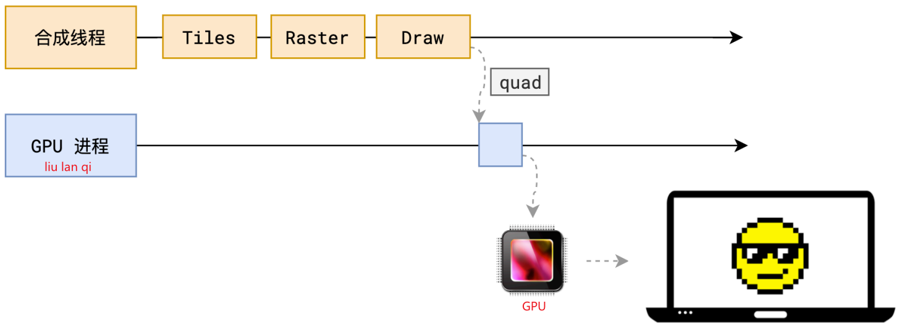
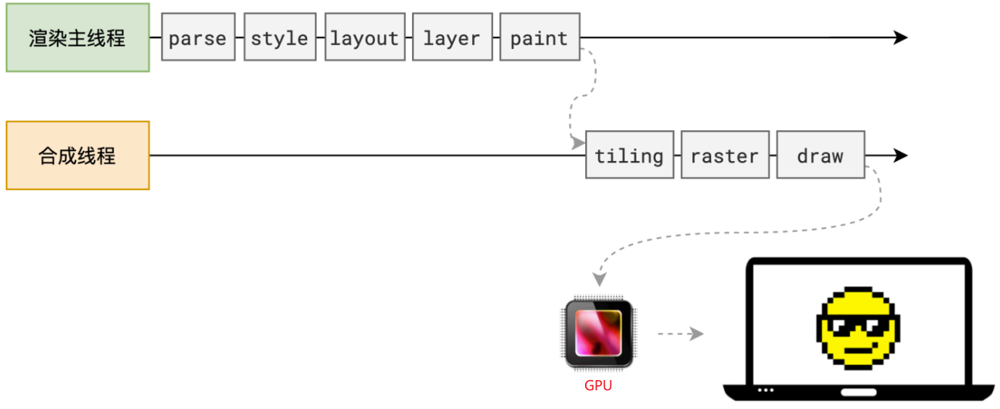
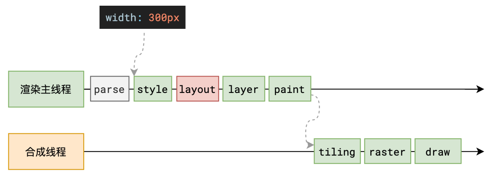
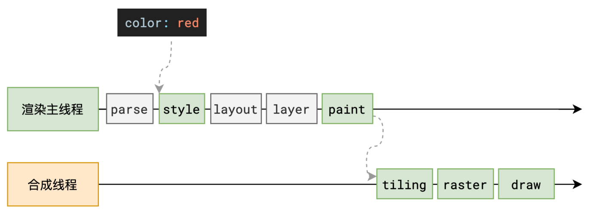

## 画 - Draw

合成线程计算出每个位图在屏幕上的位置，交给 GPU 进⾏最终呈现



完整过程



:::important

css transform 为什么特别快？ 因为 transform 是在这个步骤进行的。不是在渲染主线程上。

大概就是将位图进行矩阵变换。

:::

## 相关问题

重排



为了避免连续的多次操作导致布局树反复计算，浏览器会合并这些操作，当 JS 代码全部完成后再进行统一计算。所以，改动属性造成的 reflow 是异步完成的。

也同样因为如此，当 JS 获取布局属性时，就可能造成无法获取到最新的布局信息。

浏览器在反复权衡下，最终决定获取属性立即 reflow（同步）。

```js
// 如果没有读取都没操作，下面这些改动会合并成一次异步reflow
dom.style.width = '100px'
dom.style.height = '100px'
dom.style.margin = '10px'
dom.style.padding = '10px'

// 当读取dom信息时，则会同步reflow，再读取
// 此时读取的值是正确
// 有时会利用这个特性强制同步布局
console.log(dom.clientWidth)
```

重绘

repaint 的本质就是重新根据分层信息计算了绘制指令。


