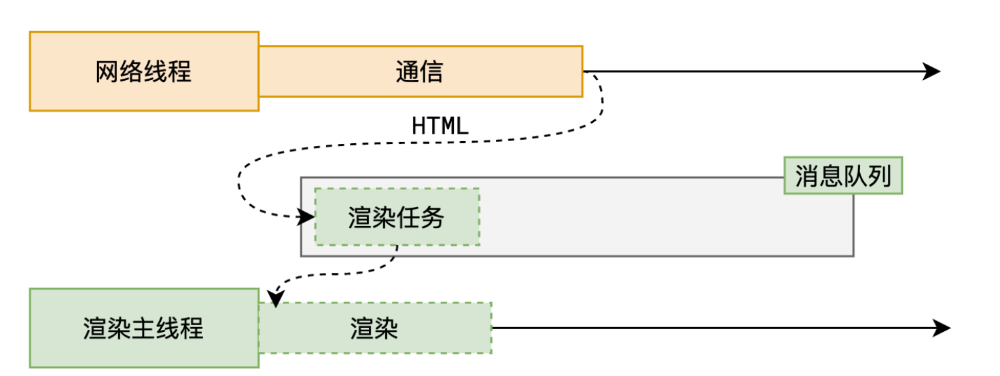
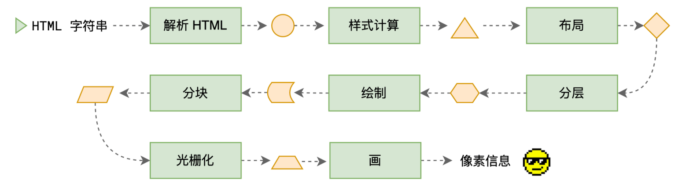
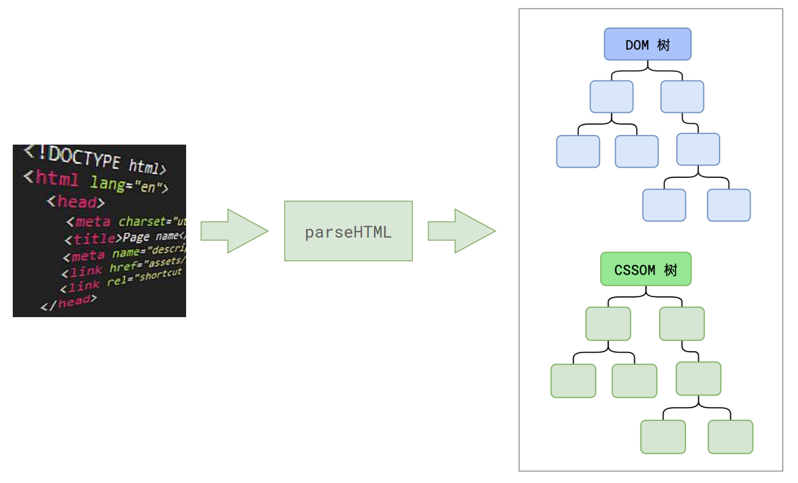
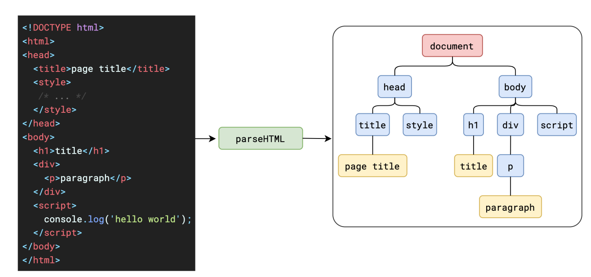
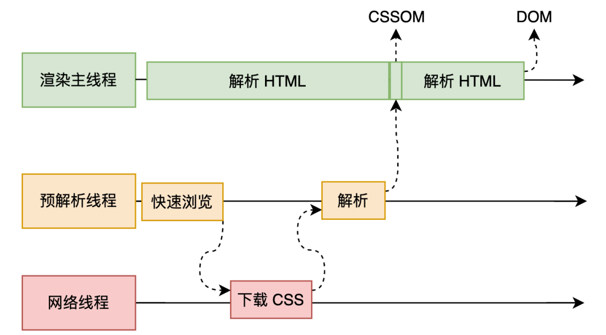
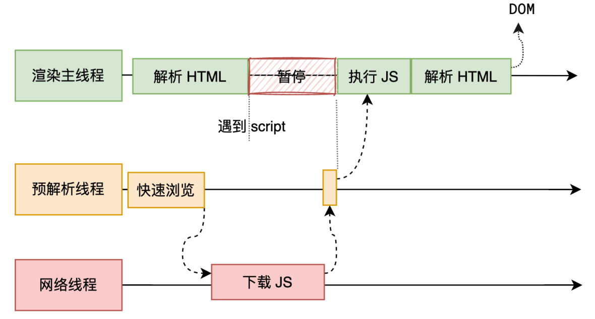

## 解析 HTML - Parse HTML

就是把 html 字符串变成画面的像素信息。

网络进程取 html 字符串，生成一个任务放在消息队列，渲染主线程拿到任务开启渲染流程。

HTML 解析过程中遇到 CSS 代码怎么办？

为了提⾼解析效率，浏览器会启动⼀个预解析器率先下载和解析 CSS

HTML 解析过程中遇到 JS 代码怎么办？

渲染主线程遇到 JS 时必须暂停⼀切⾏为，等待下载执⾏完后才能继续预解析线程可以分担⼀点下载 JS 的任务

<!-- prettier-ignore -->
::: info 
  解析 htmlstring 时，解析一个节点就生成一个dom节点。但是 js 代码有可能会改变之前生成的dom节点，因此必须等待js下载并执行完成，解析流程才能继续往下进行。
:::

当然 `<script>` 上有一些属性可以改变这种阻塞方式。 [参考MDN。](https://developer.mozilla.org/zh-CN/docs/Web/HTML/Element/script)
