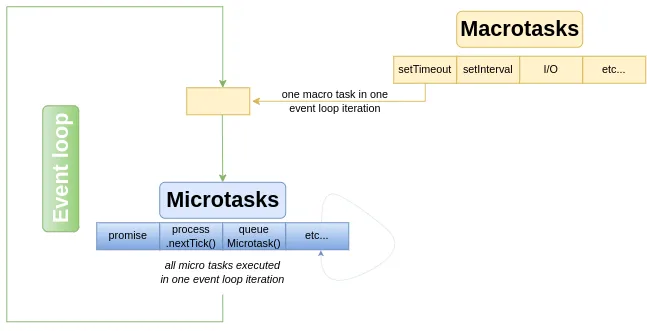

## 短路 与 (`&&`) 或 (`||`)

### 短路

短路的意思是左边执行后能知道结果就不执行右边。

如果是 `||`，左边如果是 `true`， 则右边不会执行。 例如：

- `2 == 1 + 1 || console.log('执行')`
- `1 == 1 + 1 || console.log('执行')`

如果是 `&&`, 如果左边是 `false`，则右边不会执行。例如：

- `2 == 1 + 1 && console.log('执行')`
- `1 == 1 + 1 && console.log('执行')`

下面两端代码意义相同：

- `step > max_step && (step = min_step);`
- `if (step > max_step) step = min_step;`

### 短路与或运算中的 `false`

`""`，`false`，`0`，`null`，`undefined`，`NaN` 会被当成 `false` 处理。

其他的都是 `true`。

<!-- prettier-ignore -->
::: warning 
  字符串 `"false"` 也会被当做 true 处理。 
:::

### 返回

js 的与或**并不只是**返回 `true` 和 `false` 的布尔值。

`a || b`：如果 **a** 是`true`，那么 **b** 不管是`true`还是`false`，都返回`true`。因此不用判断 **b** 了，这个时候刚好判断到 **a**，因此返回 **a**。

如果 **a** 是 `false`，那么就要判断 **b**，如果 **b** 是 true，那么返回`true`，如果 **b** 是`false`，返回`false`，其实不就是返回 **b** 了吗。

`a && b`：如果 **a** 是 `false`，那么 **b** 不管是`true`还是`false`，都返回`false`，因此不用判断 **b** 了，这个时候刚好判断到 **a**，因此返回 **a**。

如果 **a** 是 `true`，那么就要在判断 **b**，和刚刚一样，不管 **b** 是`true`是`false`，都返回 **b**。

### 练习

尝试得出下面的返回结果：

```javascript
var a = new Object(),
  b = 0,
  c = Number.NaN,
  d = 1,
  e = 'Hello'

console.log(a || (b && c) || (d && e))
```

<!-- prettier-ignore -->
::: tip
  在 js 中 `&&` 运算符优先级大于 `||`。 
:::

## js 中的 trick

### `+`

加法运算符（+）为两种不同的运算重载：数字加法和字符串连接。在求值时:

1. 首先将两个操作数[强制转换](https://developer.mozilla.org/zh-CN/docs/Web/JavaScript/Data_structures)为基本类型。
2. 如果有一方是字符串，另一方则会被转换为字符串，并且它们连接起来。
3. 如果双方都是 BigInt，则执行 BigInt 加法。如果一方是 BigInt 而另一方不是，会抛出 TypeError。
4. 否则，双方都会被转换为数字，执行数字加法。

```javascript
['a'] + 'b' === 'ab'
[1, 2] + 3 = '1,23'
```

### `==`

`==` 会进行类型转换，`===` 不会。

### `!!`

`!!` 会将值转换为布尔值。

## microtask（task） 和 macrotask

**macrotasks**: setTimeout, setInterval, setImmediate, requestAnimationFrame, I/O, UI rendering

**microtasks**: process.nextTick, Promises, queueMicrotask, MutationObserver

[事件循环](https://html.spec.whatwg.org/multipage/webappapis.html#event-loops)



在每个宏任务之后，引擎会立即执行微任务队列中的所有任务，然后再运行任何其他宏任务或渲染或其他任何任务。

需要注意的是，每个事件循环都有一个正在运行的宏任务，他要么是空，要么是任务。这个宏任务执行完毕后，会执行微任务队列中的所有任务。微任务执行过程中，也可以添加新的微任务，继续运行，直到微任务队列清空。进入下一次事件循环，取下一个宏任务执行。

```javascript
console.log('script start')

// setTimeout 是宏任务, 在下一次事件循环中，
// 如果宏任务队列中没有在其前面其他宏任务，则第一个执行
setTimeout(function () {
  console.log('setTimeout1')
}, 0)

// 在本次事件循环中，微任务是可以入队的，
// 所以本次事件循环会清空所有微任务，promise 在本次事件循环就可执行
Promise.resolve().then(function () {
  console.log('promise1')
})

// ----- console ------
// script start
// promise1
// setTimeout1
```

所以造成一种假象，就是微任务队列中的任务是比宏任务先执行。可以看[setTimeout](https://developer.mozilla.org/zh-CN/docs/Web/API/setTimeout)方法的 delay 参数。

或者可以这么理解，所有单个宏任务都视为一段程序的入口，执行完毕后，会立刻执行微任务队列中的所有任务，到微任务队列清空为止。这一次的循环叫做一个事件循环。

<!-- prettier-ignore -->
::: tip 
任务队列中的任务只有当调用栈是空的时候才会将任务 push 进调用栈中执行。 
:::

- [视频](https://www.youtube.com/watch?v=8aGhZQkoFbQ)
- [可视化演示 1](https://jakearchibald.com/2015/tasks-microtasks-queues-and-schedules/)
- [可视化演示 2](https://jakearchibald.com/2015/tasks-microtasks-queues-and-schedules/)

## 递归

递归函数必须有一个终止条件，否则会无限递归。停止调用的条件叫做基线条件（base case）。

**1. 一只青蛙一次可以跳上 1 级台阶，也可以跳上 2 级台阶。求该青蛙跳上一个 n 级的台阶总共有多少种跳法。**

#### 第一步：明确递归关系 （找规律）

- 如果只有 1 级台阶，那么只有 1 种跳法
- 如果有 2 级台阶，那么有 2 种跳法
- 如果有 3 级台阶，那么有 3 种跳法
- 如果有 4 级台阶，那么有 5 种跳法
- 如果有 5 级台阶，那么有 8 种跳法
- ...
- 如果有 n 级台阶，那么有 `f(n)=f(n-1)+f(n-2)` 种跳法

脑瓜子聪明一下能想到，想不到就列出情况找规律。

青蛙是怎么到达第 n 级台阶的呢？

他可以从第 n-1 级台阶跳上来，也可以从第 n-2 级台阶跳。前面无论怎么跳，最后一跳不同，所以 `f(n)=f(n-1)+f(n-2)`。

#### 第二步：明确终止条件

我们选择 `f(1)=1` 和 `f(2)=2` 作为终止条件。

```javascript
function jump(n) {
  if (n === 1) return 1
  if (n === 2) return 2
  return jump(n - 1) + jump(n - 2)
}
```

2. **二叉树的最大深度**

#### 第一步：明确递归关系 （找规律）

二叉树的深度为左右子树深度的最大值加 1。

#### 第二步：明确终止条件

```javascript
function maxDepth(root) {
  if (!root) return 0
  return Math.max(maxDepth(root.left), maxDepth(root.right)) + 1
}
```

## slice 和 splice

`slice` 不会改变原数组。参数指定启始位置和结束位置，返回一个区间内的新数组，且不包括结束位置。\[start, end\)

数组从做到右，从 0 开始计数，如果是负数，则从右到左，从 -1 开始计数。

`splice` 会改变原数组。很强大的数组方法，它有很多种用法，可以实现删除、插入和替换。

1）、删除元素,并返回删除的元素

可以删除任意数量的项，只需指定 2 个参数：要删除的第一项的位置和要删除的项数。例如， `splice(0,2)`会删除数组中的前两项。

```javascript
var arr = [1, 2, 3, 4, 5]
arr.splice(0, 2) // [1, 2]
```

2）、向指定索引处添加元素

可以向指定位置插入任意数量的项，只需提供 3 个参数：起始位置、 0（要删除的项数）和要插入的项。例如，`splice(2,0,4,6)`会从当前数组的位置 2 开始插入 4 和 6。

```javascript
var arr = [1, 2, 3, 4, 5]
arr.splice(2, 0, 4, 6) // []
arr // [1, 2, 4, 6, 3, 4, 5]
```

3）、替换指定索引位置的元素

可以向指定位置插入任意数量的项，且同时删除任意数量的项，只需指定 3 个参数：起始位置、要删除的项数和要插入的任意数量的项。插入的项数不必与删除的项数相等。例如，`splice (2,1,4,6)`会删除当前数组位置 2 的项，然后再从位置 2 开始插入 4 和 6。

```javascript
var arr = [1, 2, 3, 4, 5]
arr.splice(2, 1, 4, 6) // [3]
arr // [1, 2, 4, 6, 4, 5]
```

## 对象规则设置

- 冻结

  冻结对象：`Object.freeze(obj)`

  检测对象是否被冻结： `Object.isFeozen(obj)`

  被冻结的对象：不能修改成员值，不能删除，新增成员，不能给成员做劫持 (`Object.defineProperty`)

- 密封

  密封对象：`Object.seal(obj)`

  检测对象是否被密封： `Object.isSealed(obj)`

  被密封的对象：能修改成员值，不能删除，新增成员，不能给成员做劫持 (`Object.defineProperty`)

- 不可扩展

  把对象变为不可扩展：`Object.preventExtensions(obj)`

  检测对象是否可扩展： `Object.isExtensible(obj)`

  不可扩展的对象：能修改成员值，能删除，不能新增成员，能给成员做劫持 (`Object.defineProperty`)

react 的 props 是被冻结的

## Promise

可改变状态的三种方式：

1. `resolve` pending -> fulfiled
2. `reject` pending -> rejected
3. `throw 'err'` pending -> rejected

用 `then` 为 Promise 实例 **非链式** 指定多个回调，回调都会执行，且回调都会拿到结果。

链式调用则是取决于上一个 then 返回 promise 对象。

```js
const p = new Promise((resolve, reject) => {
  const a = Math.random()
  a > 0.5 ? resolve(a) : reject(a)
})

// 非链式指定
p.then(
  value => {
    console.log('1ok' + value)
  },
  err => {
    console.log('1err' + err)
  },
)

// 非链式指定
p.then(
  value => {
    console.log('2ok' + value)
  },
  err => {
    console.log('2err' + err)
  },
)

// 非链式指定
p.then(
  value => {
    console.log('3ok' + value)
  },
  err => {
    console.log('3err' + err)
  },
)
```

`then` 的返回结果是一个 Promise 对象，该对象的状态和结果由 **所执行的回调** 的返回结果决定。所执行的回调由两种情况：1. 成功回调 2. 失败回调

`async function` 的返回结果是一个 Promise 对象，该对象的状态和结果由 **函数本身** 的返回结果决定。规则和 `then` 一样，如下所示：

```js
const thenResult = new Promise((resolve, reject) => {
  const a = Math.random()
  a > 0.5 ? resolve(a) : reject(a)
}).then(
  value => {
    console.log(value)
    // 1. 不返回 或 返回非 promise 对象： 状态 fulfilled 成功， 结果 返回值
    // return 123

    // 2. 返回 promise 对象： 状态和结果由返回的 promise对象决定
    // return Promise.resolve(1)

    // 3. throw 状态 rejected 失败， 结果 抛出值
    throw 'errrrrrrrrrrrr'
  },
  err => {
    // 4. 当 a < 0.5 进入这个回调，因为这个回调无返回值， 所以状态是 fulfilled 成功， 结果 undefied
    console.log(err)
  },
)

console.log(thenResult)
```

中断 promise 链，有且只有一种方式，返回一个 pending 状态的 Promise 对象。

```js
Promise.resolve()
  .then(v => {
    console.log(1)
    // 有且只有一种方式，返回一个 pending 状态的 Promise 对象
    return new Promise(() => {})
  })
  .then(v => {
    console.log(2)
  })
  .then(v => {
    console.log(3)
  })
```
