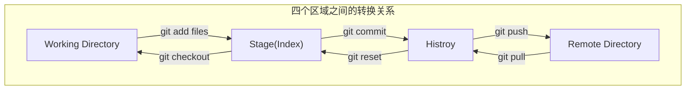

## Git 基本理论

Git 本地仓库由三部分组成：工作区（working directory）、暂存区（Stage/Index）、版本库（Repository 或Git Directory）。

另外还有一个远程仓库（Remote Directory）。

一共四个工作区。


#### 工作区（Working Directory）

就是你在电脑里能看到的目录，比如我的 `ganymede` 文件夹 就是一个工作区。

#### 版本库（Repository）
 
工作区有一个隐藏目录 `.git`，这个不算工作区，而是 Git 的版本库。

Git 的版本库里存了很多东西，其中最重要的就是称为 stage（或者叫 index ）的暂存区，还有 Git 为我们自动创建的第一个分支 master，以及指向 master 的一个指针叫 HEAD。

## 文件状态

用命令 `git status` 查看当前文件状态。

- Untracked: 未跟踪, 此文件在文件夹中, 但并没有加入到 git 库, 不参与版本控制. 通过 `git add` 状态变为 Staged.

- Unmodify: 文件已经入库, 未修改, 即版本库中的文件快照内容与文件夹中完全一致. 这种类型的文件有两种去处, 如果它被修改, 而变为 Modified. 如果使用`git rm` 移出版本库, 则成为 Untracked 文件

- Modified: 文件已修改, 仅仅是修改, 并没有进行其他的操作. 这个文件也有两个去处, 通过 `git add` 可进入暂存staged状态, 使用`git checkout` 则丢弃修改过, 返回到 unmodify 状态, 这个 `git checkout` 即从库中取出文件, 覆盖当前修改!

- Staged: 暂存状态. 执行 `git commit` 则将修改同步到库中, 这时库中的文件和本地文件又变为一致, 文件为Unmodify状态. 执行`git reset HEAD filename`取消暂存, 文件状态为 Modified

```bash
86131@DESKTOP-BB07JT8 MINGW64 /e/其他项目/git-learn (main)
$ touch test.txt

86131@DESKTOP-BB07JT8 MINGW64 /e/其他项目/git-learn (main)
$ git status
On branch main
Your branch is up to date with 'origin/main'.

Untracked files:
  (use "git add <file>..." to include in what will be committed)
        test.txt

nothing added to commit but untracked files present (use "git add" to track)

86131@DESKTOP-BB07JT8 MINGW64 /e/其他项目/git-learn (main)
$ git add .

86131@DESKTOP-BB07JT8 MINGW64 /e/其他项目/git-learn (main)
$ git status
On branch main
Your branch is up to date with 'origin/main'.

Changes to be committed:
  (use "git restore --staged <file>..." to unstage)
        new file:   test.txt

86131@DESKTOP-BB07JT8 MINGW64 /e/其他项目/git-learn (main)
$ git commit -m "first commit"
[main 2605f13] first commit
 1 file changed, 0 insertions(+), 0 deletions(-)
 create mode 100644 test.txt

86131@DESKTOP-BB07JT8 MINGW64 /e/其他项目/git-learn (main)
$ git status
On branch main
Your branch is ahead of 'origin/main' by 1 commit.
  (use "git push" to publish your local commits)

nothing to commit, working tree clean

```

## Git 分支

- git branch: 查看本地分支
- git branch -r: 查看远程分支
- git branch -a: 查看所有分支
- git checkout -b dev: 创建并切换到 dev 分支
- git switch -c dev: 创建并切换到 dev 分支
- git merge dev: 合并 dev 分支到当前分支
- git branch -d dev: 删除 dev 分支
- git branch -D dev: 强制删除 dev 分支(dev的代码没有被merge)
- git push origin --delete dev: 删除远程 dev 分支
- git log --graph --pretty=oneline --abbrev-commit: 查看分支合并图

## 查看历史记录

- git log: 查看历史记录
- git log --pretty=oneline: 查看历史记录，一行显示

## 回退历史

`commit id`（版本号）,每个人看到的肯定不一样

在Git中，用 `HEAD` 表示当前版本，也就是最新的提交 `1094adb...`（注意我的提交ID和你的肯定不一样），上一个版本就是 `HEAD^`，上上一个版本就是 `HEAD^^`，当然往上 100 个版本写 100 个 `^` 比较容易数不过来，所以写成 `HEAD~100`。

- git checkout -- \<file\>: 撤销工作区的修改(还未到暂存区 ，即没有执行git add)
  
  `git checkout -- file` 命令中的 `--` 很重要，没有 `--`，就变成了“切换到另一个分支”的命令，我们在后面的分支管理中会再次遇到 `git checkout` 命令。`git checkout` 其实是用版本库里的版本替换工作区的版本，无论工作区是修改还是删除，都可以“一键还原”。
- git reset HEAD \<file\>: 撤销暂存区的修改，重新放回工作区(已经到暂存区，即已经执行git add)
- git reset --hard HEAD^: 回退到上一个版本
- git reset --hard \<commit id\>: 回退到指定版本

## 推送分支到远程

git push origin \<branch-name\>: 推送分支到远程。 branch-name 为要推送的本地分支名

多人协作的工作模式通常是这样：

1. 首先，可以试图用`git push origin <branch-name>`推送自己的修改；

2. 如果推送失败，则因为远程分支比你的本地更新，需要先用`git pull`试图合并；

3. 如果合并有冲突，则解决冲突，并在本地提交；

4. 没有冲突或者解决掉冲突后，再用`git push origin <branch-name>`推送就能成功！

如果`git pull`提示`no tracking information`，则说明本地分支和远程分支的链接关系没有创建，用命令`git branch --set-upstream-to <branch-name> origin/<branch-name>`。

这就是多人协作的工作模式，一旦熟悉了，就非常简单。


## Git global setup

```bash
git config --global user.name xxxx
git config --global user.email xxx@yyy.com
```

## 在命令行上创建一个新的存储库

```bash
git clone https://aaa.bbb.com/ccc/ddd.git
cd geely-tsp-config-center
touch README.md
git add README.md
git commit -m "add README"
git push -u origin master
```

## 从命令行推送现有空的存储库

```bash
cd existing_folder
git init
git remote add origin https://aaa.bbb.com/ccc/ddd.git
git add .
git commit -m "Initial commit"
git push -u origin master
```

## 从命令行推送已有存储库

```bash
cd existing_repo
git remote add origin https://aaa.bbb.com/ccc/ddd.git
git push -u origin --all
git push -u origin --tags
```

## stash

列子：将一个分支的修改应用到另一个分支。

1. 在 wj/dev 上 git reset --soft commitID(该条 commitID 之后的修改，不包括本身), 保留本地修改
2. 在 wj/dev 上 git stash 将工作区改动暂存
3. 从 wj/dev 切换到 master 分支, 从 master 且一个新的分支 checkout -b wj/new-dev
4. 在 wj/new-dev 上 git stash pop 将暂存的工作区改动应用到当前分支
5. 在 wj/new-dev 上 git add . git commit -m "xxx" git push origin wj/new-dev

## commit message 提交规范

- **feat**：新增功能
- **fix**：bug 修复
- **docs**：文档更新
- **style**：不影响程序逻辑的代码修改(修改空白字符，格式缩进，补全缺失的分号等，没有改变代码逻辑)
- **refactor**：重构代码(既没有新增功能，也没有修复 bug)
- **perf**：性能, 体验优化
- **test**：新增测试用例或是更新现有测试
- **build**：主要目的是修改项目构建系统(例如 glup，webpack，rollup 的配置等)的提交
- **ci**：主要目的是修改项目继续集成流程(例如 Travis，Jenkins，GitLab CI，Circle 等)的提交
- **chore**：不属于以上类型的其他类，比如构建流程, 依赖管理
- **revert**：回滚某个更早之前的提交
