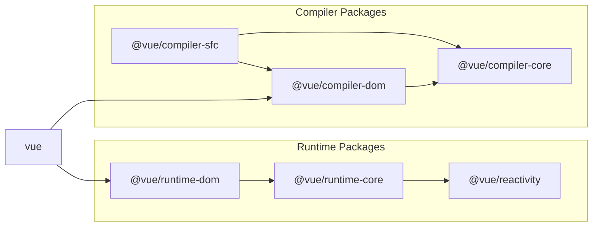
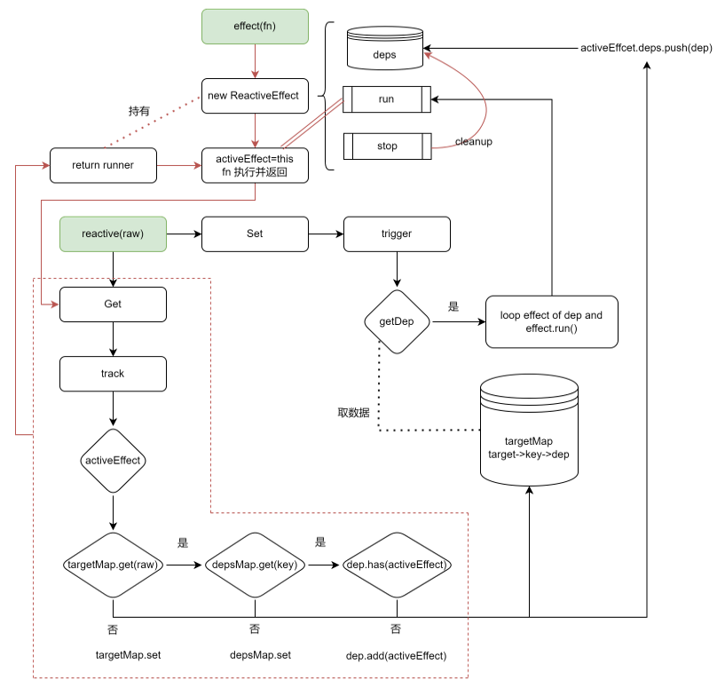
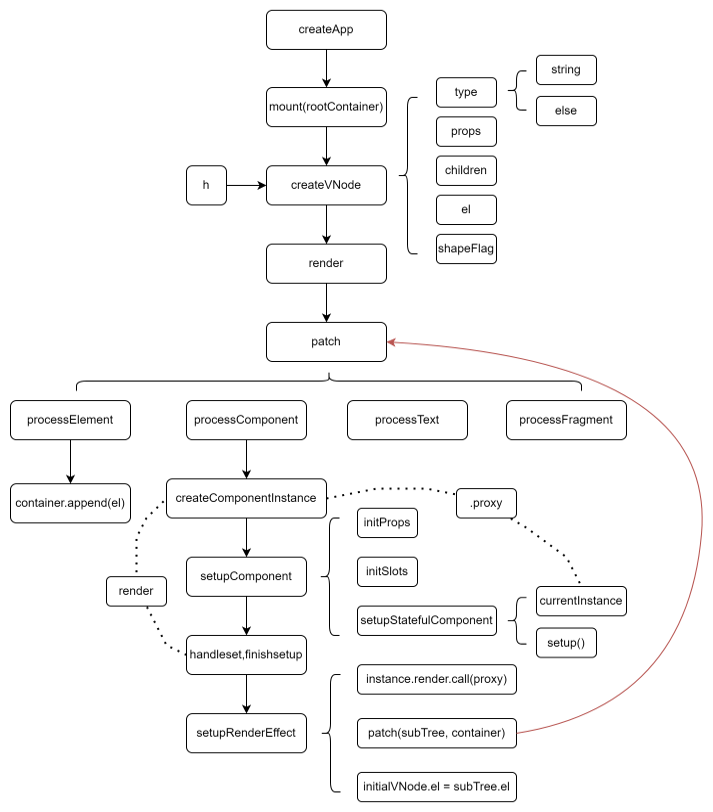
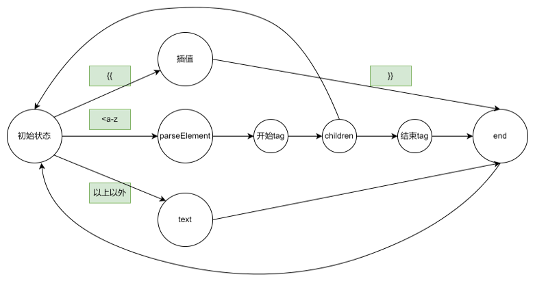

## 源码结构

```
├── packages
│ ├── compiler-core // 核心编译器（平台无关）
│ ├── compiler-dom // dom 编译器
│ ├── compiler-sfc // vue 单文件编译器
│ ├── compiler-ssr // 服务端渲染编译
│ ├── global.d.ts // typescript 声明文件
│ ├── reactivity // 响应式模块，可以与任何框架配合使用
│ ├── runtime-core // 运行时核心实例相关代码（平台无关）
│ ├── runtime-dom // 运行时 dom 关 api，属性，事件处理
│ ├── runtime-test // 运行时测试相关代码
│ ├── server-renderer // 服务端渲染
│ ├── sfc-playground // 单文件组件在线调试器
│ ├── shared // 内部工具库,不对外暴露 API
│ ├── size-check // 简单应用，用来测试代码体积
│ ├── template-explorer // 用于调试编译器输出的开发工具
│ └── vue // 面向公众的完整版本, 包含运行时和编译器
```



## reactivity

reatcive:



ref:

// todo

ref:

// todo

## runtime-core

初始化流程:



更新流程:

// todo

## compiler-core

template parse 的原理是有限状态机, 当遇到特定字符就迁移到另一种状态,如下图所示:



同时, 我们常用的正则的实现原理也是有限状态机, 我们看下面的代码:

```javascript
console.log("正则结果", /abc/.test("aaaacccapabcpppp"));
console.log("有限状态机结果", testABC("aaaacccapabcpppp"));

console.log("正则结果", /abc/.test("1122ababababababrrr"));
console.log("有限状态机结果", testABC("1122ababababababrrr"));

function testABC(string) {
  // 每个方法都是一个状态
  // 当匹配到 'a', 迁移到下一个状态 waitForB
  // 否则回到初始状态 waitForA
  function waitForA(char) {
    if (char === "a") {
      return waitForB;
    }

    return waitForA;
  }

  // 当匹配到 'b', 迁移到下一个状态 waitForC
  // 否则回到初始状态 waitForA
  function waitForB(char) {
    if (char === "b") {
      return waitForC;
    }

    return waitForA;
  }

  // 当匹配到 'c', 迁移到下一个状态 end
  // 否则回到初始状态 waitForA
  function waitForC(char) {
    if (char === "c") {
      return end;
    }

    return waitForA;
  }

  // 结束状态  标识着正确匹配结束
  function end() {
    return end;
  }

  let currentState = waitForA;

  for (let i = 0; i < string.length; i++) {
    currentState = currentState(string[i]);

    if (currentState === end) {
      return true;
    }
  }

  return false;
}
```
